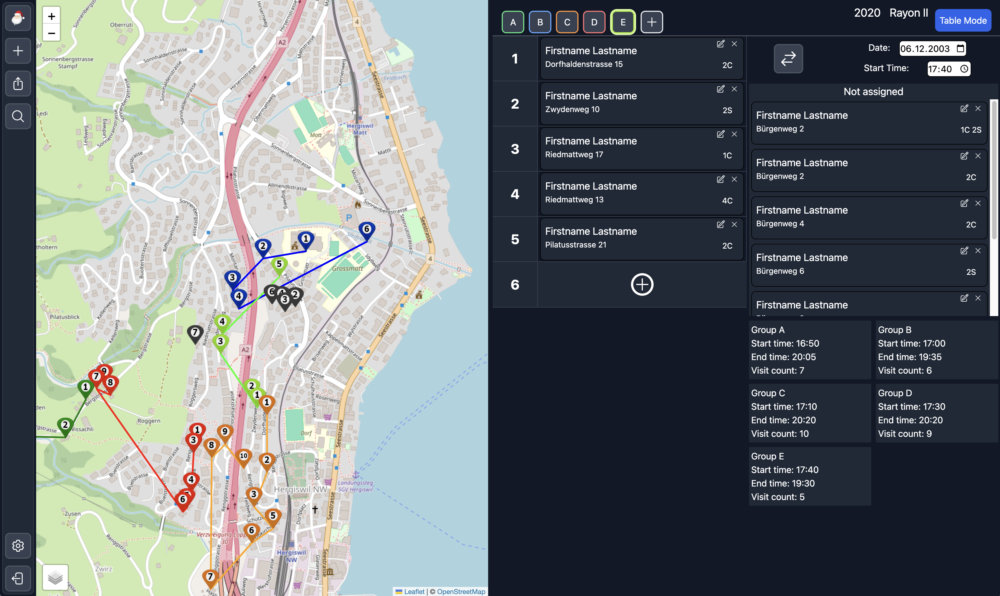

# Samichlaus Creator Frontend

Single Page React App for creating and managing short round trips for multiple Groups with Customers. Created for the non-profit organization [Samichlaus-Vereinigung Hergiswil](https://www.samichlaushergiswil.ch/) as a side-project of mine. It works with the [Samichlaus Creator Backend]().

## Description


The image is the main page after a successful login. The sidebar is used for navigation (Adding Customers, Bulk CSV Import, Searching Previous Customers etc.). On the left is a [Leaflet Map](https://leafletjs.com/) where the current round trips are visualized. On the right one can change the round trips by drag and drop, adding or removing groups as necessary and more.

### Technologies used

- *JavaScript*
- [React](https://react.dev/)
- [Vite](https://vitejs.dev/)
- [Tailwind CSS](https://tailwindcss.com/)
- [Leaflet](https://leafletjs.com/)

## Getting Started

### Dependencies

Make sure you have a working installation of [nodejs](https://nodejs.org/en/download/package-manager) and [yarn](https://classic.yarnpkg.com/lang/en/docs/install) on your system.

### Installing

Clone the github repo and enter the root directory.
```git clone ```
Install the npm packages with yarn.
```yarn install```
Make sure to change the environment variables an example is given in [.env.EXAMPLE]. For development create a *.env.development* file and for production create a *.env.production* file in the root with the ENV variables.

### Running/Building server

Start dev server by running.
```yarn dev```
Building for production with.
```yarn build```

## Version History

* 0.2.0 (main branch)
    * Sending Emails with the visit time to Customers
    * Bug fixes and other small improvements
    * See [release history]()
* 0.1.x
    * Initial Release
    * See [release branch]()

## Authors

Name: Nico Bachmann
Email: [contact@famba.me](mailto:contact@famba.me)

## License

This project is licensed under the GNU GPL License - see the LICENSE file for details
